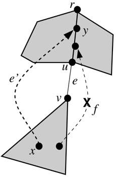
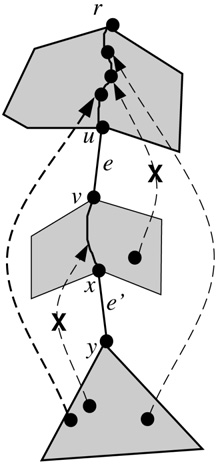
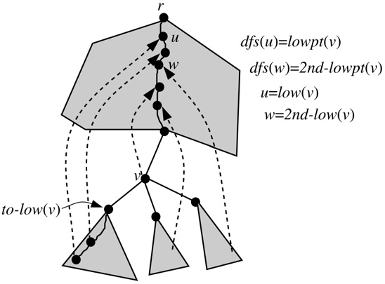

## 预备工作

### 引理3.1

令$e(u,v),e'(x,y)$是割对，显然其中至多一个是返祖边，因为如果都是返祖边，删掉它们不影响连通性。

首先假定$e$是树边。

如果$e'$是返祖边，那么$y$是$u$的祖先，$x$是$v$的后代。

如果$e$和$e'$都是树边，那么它们位于同一条根到叶子节点的路径。（否则至少有一个是桥，与定义矛盾）

证明：看图。

### 定理3.2

如果$e'$是返祖边，当且仅当不存在返祖边$f(s,t)$，其中$s$是$v$的后裔，$t$是$u$的祖先。

如果$e'$是树边，当且仅当不存在返祖边$f(s,t)$，满足其中一条——

1. $s$是$v$的后代和$x$的祖先，$t$是$u$的祖先；
2. $s$是$y$的后代，$t$是$v$的后代和$x$的祖先。

证明：看图。

#### 定义

令$e$为割边，如果$e$是返祖边，或者$e$是树边且没有其它（树边或有一个端点在$y$的子树内的返祖边）与$e$形成割对，那么称$e$为发出边。

### 引理3.3

令$e,e'$为割对且都为树边，如果$f,e'$是割对，那么$f$是发出边，$f,e'$也是割对。

进一步得到每一个割边都属于一个包含发出边的割对。

证明：结合定义看图。

### 引理3.4

点$v$是点$u$的祖先当且仅当$dfn_v\le dfn_u\le dfn_v+nd_v-1$（$nd_v$是$v$的后代数量）

#### 定义

$lowpt_v$和Tarjan算法中的定义是一样的。$2nd-lowpt_v$顾名思义，是$v$子树内通过返祖边能回到的第二低的位置的$dfn$。

$low_v,2nd-low_v$则定义为返回到的点的编号。

$v$的趋向边通俗来讲是沿着$v$到$low_v$的路径的下一条边。如果有$(v,low_v)$的返祖边，那么就是它；否则是DFS过程中访问到的第一个儿子$w$满足$lowpt_w=lowpt_v$的树边，趋向点$to-low_v$即是$w$。

$v$的趋向路径是包含连续趋向边的到达$low_v$的最长的一条路径。注意，在忽略重边的前提下，趋向边和趋向路径都是唯一的。

通过图理解一下。

### 引理3.5

$v$的趋向路径是一条$v-low_v$的回路。比较显然。

### 引理3.6

令$v\in V-\{r\}$（$r$为树根），如果$e,e'$是割对，满足$e'$是$T_v$（$v$的子树）中的树边或一个端点在$T_v$中的非树边，而$e$在$T_v$外部，那么$e'$必须在$v$的趋向路径上，同时$e$在$low_v-v$的树路径上。

#### 证明

引理3.1意味着$e$在$r-v$的树路径上，而定理3.2意味着$e$要在$low_v-v$树路径上。

反证，先假设$e'$不在$v$的趋向路径上。

令$e=(u,w),e'=(x,y)$。此外，根据引理3.5，$v$的趋向路径是一条$v-low_v$的回路，令$f=(z',low_v)$为趋向路径中的那条返祖边。

1. 假设$e'$是返祖边。根据引理3.1，$e$必须在$y-x$树路径上，又因为在$T_v$外，所以一定在$y-v$上。如果$x$在$v$的趋向路径上，那么既然我们要$e'$不在$v$的趋向路径上也就是$e'$不是趋向边，必须满足$dfn_y\ge lowpt_x=lowpt_v$。如果$x$不在$v$的趋向路径上，设$a$为$v$趋向路径上离$x$最近的点，$b$为$a$在$a-x$上的子节点。因为$b$不是$a$的趋向点，所以要满足$dfn_y\ge lowpt_x\ge lowpt_b\ge lowpt_a=lowpt_v$。无论哪种情况，我们都得到了$dfn_y\ge lowpt_v$。但此时$f$满足$low_v$是$y$的祖先因此也是$u$的祖先，且$z'$是$w$的后代，与定理3.2(1)矛盾。
2. 假设$e'$是树边。令$a$为。。。

## 算法的高级描述

### 引理4.1

令$e=(x,y),f=(u,v)$使得$e$是发出边且$e,f$是割对。令$e'=(w,z)$为$v-x$树路径上的另一个发出边。那么所有与$e'$形成割对的边必须在$v-w$树路径上。

令$(x,y)$为

| Key words                  | 翻译                   |
| -------------------------- | ---------------------- |
| parallel edges             | 重边                   |
| bridge                     | 桥                     |
| cut-pair                   | 割对（双桥）           |
| cut-edge                   | 割边（割对中的一条边） |
| 3-edge-connected component | 边三连通分量           |
| subtree                    | 子树                   |
| ancestor                   | 祖先                   |
| descendant                 | 后代                   |
| tree-edge                  | 树边                   |
| back-edge                  | 非树边（返祖边）       |
| head/tail                  | 和平常的遍历顺序相反   |
| level                      | 层（深度）             |
| generator                  | 发出边                 |
| tree-path                  | 树路径                 |
| back-path                  | 回路                   |
| to-low edge                | 趋向边                 |
| to-low path                | 趋向路径               |